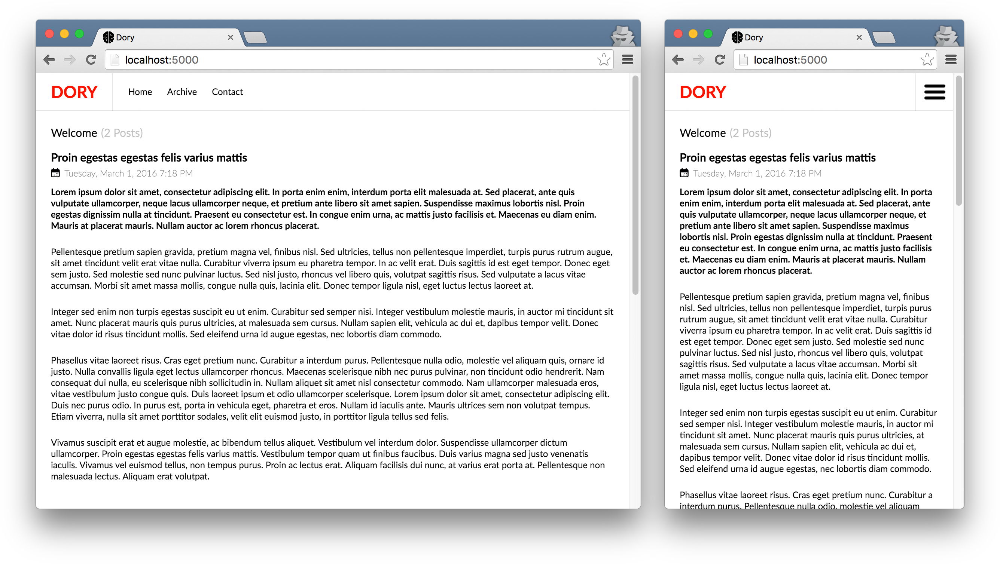

> Dory should have a blog to write before she forgets. 
> So don't be like her else you'll have many regrets. 
> And don't tell Dory she needs the internets.

&nbsp;

&nbsp;

**Dory** is a [universal](https://medium.com/@mjackson/universal-javascript-4761051b7ae9#.z4idbohho) JavaScript React blogging platform running on top of Express. By combining awesome features such as automatic RSS generation, [HTML5 offline support](https://developer.mozilla.org/en-US/docs/Web/API/Service_Worker_API), push notifications, with a powerful development environment using [hot reloading](https://github.com/gaearon/react-hot-loader), SASS and Markdown, Dory allows you to quickly dive into the depths of blogging.

---

## Getting Started

You first need to fork the repository to your own GitHub account &mdash; and then clone it.

* `npm install`
* `npm run build`
* `npm run start`

## Post

### YAML

* `author`: Places the author's name underneath the post's title;
* `email`: Used to place author's avatar from [Gravatar](https://en.gravatar.com/);
* `paid`: Adds `rel="nofollow"` to all anchors that link to the post;

## Features

* Provides a [universal JavaScript](https://medium.com/@mjackson/universal-javascript-4761051b7ae9) environment using React and Express;
* Integrates native [Markdown](https://github.com/evilstreak/markdown-js) support for generating blog posts;
* Instantaneous publishing to [Heroku](https://www.heroku.com/) for each post via [Travis CI](https://travis-ci.org/);
* Supports [Webpack Hot Reloading](https://github.com/webpack/docs/wiki/hot-module-replacement-with-webpack) for rapid development;
* Generates a valid [RSS](https://en.wikipedia.org/wiki/RSS) feed when you publish articles;

### Upcoming

* Automatically pings via [Ping-o-matic](http://pingomatic.com/) to notify of updates;
* Generates a [`sitemap.xml`](http://www.sitemaps.org/protocol.html) with automatic XSLT styling;
* Integrates [Disqus](https://disqus.com/) for post commenting when enabled via `dory.yml`;
* Utilises HTML5 [`ServiceWorker`](https://developer.mozilla.org/en-US/docs/Web/API/Service_Worker_API) for offline support;
* Seamlessly applies background sync for posting comments when offline;
* Implements the HTML5 [Push API](https://developer.mozilla.org/en/docs/Web/API/Push_API) for notifying users of added posts;
* Allows integration of generic pages &ndash; such as about and contact us;
* [Have an idea?](https://github.com/Wildhoney/Dory/issues/new)

