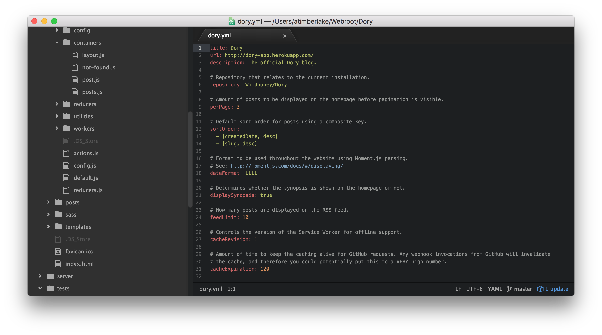

# Getting Started

We'll first start by configuring Dory locally using the [Webpack Dev Server](https://webpack.github.io/docs/webpack-dev-server.html) with hot reloading &mdash; and then gradually move to deploying our [blog to Heroku](TRAVIS_HEROKU.md).

* Fork the [Dory](https://github.com/Wildhoney/Dory) repository into your own GitHub account;
* Install dependencies using `npm i`;
* Run the initial build for the blog using `npm run build`;
* Start the local development server using `npm run start`;

Once you have issued the `npm run start` command you will be up and running on port <kbd>5000</kbd> by default &mdash; and therefore navigating to <kbd>[localhost:5000](http://localhost:5000/)</kbd> should render the default Dory instance with a handful of posts.

**Note:** You may run the server on a different port by changing the `PORT` environment variable: `PORT=3000 npm run start`.

## Configure Repository

By default the repository details point to `Wildhoney/Dory` and this is where commits will be found to determine the author and publishing date of each post &mdash; open `dory.yml` and change the `repository` to match your forked repository.

**Note:** Valid as of 23rd March, 2016.

Whilst you have the `dory.yml` file open, you can go ahead and change the `title`, `url` and `description` options to personalise your blog &mdash; making it look less like the default Dory instance!

After you have modified the configuration, you must *currently* run `npm run build` for the application to reflect the changes &mdash; however this will soon change to prevent the need.