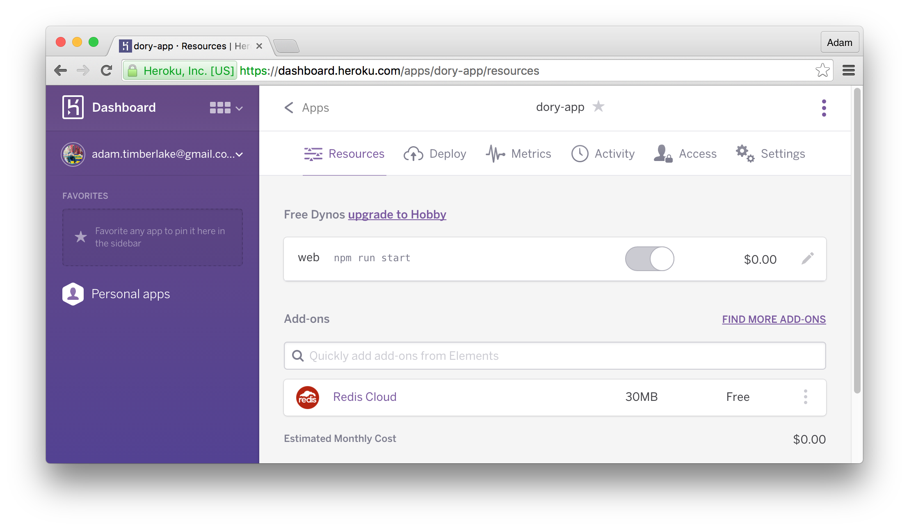

# Redis

Each time an API call is made, Dory queries GitHub to discover the author and published date of each post &mdash; for these cases it's **important** that you are [authenticating with GitHub](GITHUB.md) otherwise [default rate limits](https://developer.github.com/v3/rate_limit/) apply. However by introducing Redis into the mix, those queries are cached using a TTL defined in the `dory.yml` configuration.

By default Dory doesn't connect to Redis &mdash; it instead waits until `REDIS_HOST` has been defined as an environment variable before any connection is attempted.

## Setting up Heroku

Using Redis on Heroku requires [finding a provider](https://elements.heroku.com/addons) &mdash; we have a choice of which provider we use, but for the remainder of the article we'll use [Redis Cloud](https://elements.heroku.com/addons/rediscloud) as these provide the most space &mdash; 30MB &mdash; for free. Once you have applied [Redis Cloud](https://elements.heroku.com/addons/rediscloud) to your Heroku app, you will need to rename the environment variable Heroku has just added to `REDIS_HOST`.

Redis Cloud provides 30MB which should be **more** than sufficient for Dory, however you are able to pay or even introduce your own Redis instance as long as it's accessible remotely.

## Development

For development you can use the Redis instance on Heroku &mdash; or you could opt to install Redis locally. You simply need to have the `REDIS_HOST` in your list of environment variables &mdash; although it is purely optional, and without Redis configured locally each API call will simply query GitHub &mdash; and although slightly slower than cached Redis responses, may well be preferred for your development environment.

By default **all** Redis keys are cached for <kbd>120</kbd> seconds &mdash; you can change this by modifying `cacheExpiration` from the `dory.yml` configuration.

## Debugging

* You can log onto your remote Redis host by the details listed on [RedisLabs](https://app.redislabs.com/main/bdbconfiguration).
* Issue the `KEYS *` command to display all cached GitHub keys;
* Use each key with `GET` to display its cached content;
* Use `TTL` to see when each key is set to expire;
* Use `FLUSHALL` to remove **all** keys from the Redis instance;